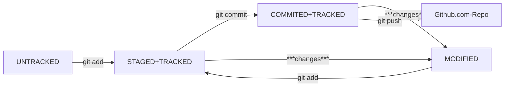

## Работа с Git, создание, коммиты, синхронизация с Github

### Инициализация репозитория на локальном компе:
**git init**  (можно перейти в GitBash в любую локальную папку и назначить ее, начальная ветка будет main, внутри появится папка .git - там вся служебная информация)

### Удаление репозитория
удалить папку **.git**

### Просмотреть состояние репозитория
**git status**  
[Тут подробности](https://practicum.yandex.ru/trainer/git-basics/lesson/d580cc52-b506-49e5-b1ee-eabae724924d/), но сначала лучше посмотреть [состояние (статусы) файлов в репозитарии](#состояние-статусы-файлов-в-репозитарии) ниже

### Подготовить файлы к сохранению
**git add --all** (подготовили к сохранению все файлы в репозитории, можно сохранять каждый файл отдельно - вместо {--all} имя файла)  
**git add .** (добавить всю текущую папку)  
*Подготовка - это как наполнение корзины в магазине (уже взяли, но еще не купили)*

### Сделать коммит (commit)
**git commit -m** '[сообщение для пояснения в чём именно состояли изменения в этом коммите](#оформление-сообщений-к-коммитам)' (закоммитит все подготовленные к сохранению файлы)  
*Коммит - это как уже покупка товаров из корзины (фиксация покупки)*  

### Просмотреть историю коммитов
**git log** (полная история)  
**git log --oneline** (в сокращенном виде)  
Если выход из просмотра логов не произошёл автоматически, нажать **Q** в английской раскладке клавиатуры

### Регистрация на GitHub и создание своего репозитария
https://github.com/ (сложностей быть не должно :) )  
https://practicum.yandex.ru/trainer/git-basics/lesson/f7e00d04-1da2-46b4-b13d-b0bf751caf88/  
https://practicum.yandex.ru/trainer/git-basics/lesson/8f24a4d9-07bf-4f9b-8fff-e7f1a2e452cc/  

### Генерация, регистрация и привязка SSH-ключа
https://practicum.yandex.ru/trainer/git-basics/lesson/42435683-0922-4231-bfb4-d7d32d61f50a/  
https://practicum.yandex.ru/trainer/git-basics/lesson/4d662a58-3602-4c5c-9fad-be8cff334f37/  
(можно и без)

### Связывание локального и удалённого репозиториев
**git remote add origin git@github.com:%ИМЯ_АККАУНТА%/%НАЗВАНИЕ_РЕПОЗИТАРИЯ%.git**

### Проверить статус связи репозитариев
**git remote -v**  
Если все ок, ответом должно быть следующее:  
origin    git@github.com:%ИМЯ_АККАУНТА%/%НАЗВАНИЕ_РЕПОЗИТАРИЯ%.git (fetch)  
origin    git@github.com:%ИМЯ_АККАУНТА%/%НАЗВАНИЕ_РЕПОЗИТАРИЯ%.git (push)  

### Отправить изменения на удалённый репозиторий
Первый раз  
**git push -u origin main** (**-u** свяжет локальную ветку с одноимённой удалённой, в дальнейшем можно без этого флага)  
Данные должны появиться на вебе GitHub.com в репозитарии.

### Состояние (статусы) файлов в репозитарии
***untracked***/***tracked***, ***staged*** и ***modified***  
  
Схема такая:  

  
**untracked** (неотслеживаемый)  
Все новые файлы в Git-репозитории помечаются как **untracked**. Git «видит», что файл существует, но не следит за изменениями в нём.
  
**staged** (подготовленный)  
После выполнения команды **git add** файл попадает в staging area (stage — «сцена» и area — «область»), то есть в список файлов, которые войдут в коммит, в этот момент файл находится в состоянии **staged** (**git add** добавляет текущее содержимое файла или нескольких файлов на "сцену", а **git commit** делает снимок всей "сцены" целиком).  
Состояние файла **staged** иногда называют **indexed** или **cached**.
  
**tracked** (отслеживаемый)  
В это "состояние" попадают файлы, которые уже были зафиксированы с помощью **git commit**, а также файлы, которые были добавлены в staging area командой **git add**, то есть все файлы, в которых Git так или иначе отслеживает изменения.
  
**modified** (изменённый)  
Состояние modified означает, что Git сравнил содержимое файла с последней сохранённой версией и нашёл отличия.  
Например, файл был закоммичен и после этого изменён.
  
*Для файлов в состояниях **staged** и **modified** обычно не указывают, что они также **tracked**, потому что это состояние подразумевается.*

### Оформление сообщений к коммитам
Правильно описывать [коммиты](#сделать-коммит-commit) — это правильно :\).  
Хорошо, когда:
* сообщение коммита легко читается;  
* оно информативное;  
* все сообщения оформлены в одном стиле.  

Например, **GitHub-стиль** можно использовать не только для хранения файлов проекта, но и для ведения списка задач (issue) этого проекта. Если коммит «закрывает» или «решает» какую-то задачу, то в его сообщении удобно указывать ссылку на неё.  
Для этого в любом месте сообщения нужно указать #<номер задачи>.  
Например, вот так:  
**$ git commit -m "Исправить #334, добавить график температуры"**  
В таком случае GitHub свяжет коммит и задачу.  
[Тут](https://www.conventionalcommits.org/ru/v1.0.0-beta.4/#%D1%81%D0%BF%D0%B5%D1%86%D0%B8%D1%84%D0%B8%D0%BA%D0%B0%D1%86%D0%B8%D1%8F) еще стандарт Conventional Commits, но можно и других источников насмотреться.

### Исправить последний коммит
**git commit --amend --no-edit** (команда изменит последний коммит БЕЗ изменения сообщения)  
**git commit --amend -m "измененное сообщение"** (команда изменит сообщение последнего коммита, без изменения содержимого)  
После применения команд выше необходимо применить команду:  
**git push --force** (не просто [**git push**](#отправить-изменения-на-удалённый-репозиторий)!)  
*!!! Git предотвращает перезапись истории центрального репозитория, отклоняя push-запросы, если нельзя выполнить их ускоренное слияние. При применении команды **git commit --amend** история удаленного репозитория будет отличаться от локальной истории*  
*Флаг **--force** отменяет это поведение и подгоняет ветку удаленного репозитория под локальную ветку, удаляя любые вышестоящие изменения. Поэтому принудительное использование команды **git push --force** оправдано лишь в том случае, когда абсолютно понятно, что только что опубликованные коммиты были не совсем правильными, были исправлены с помощью команды **git commit --amend**. При этом прежде, чем использовать опцию **--force**, нужно быть абсолютно уверенным, что никто из участников команды не "забирал" эти коммиты.*